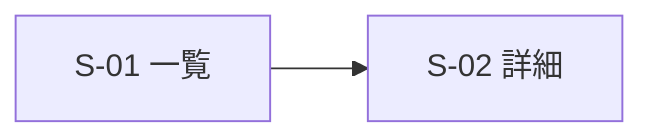

# 画面一覧・画面遷移図 — <プロジェクト名>

> 記入要領: **先行試作(中心仮説のデータ経路)が生き残ってから描く。**
> 各画面の目的は「誰が・何を・30秒以内にできる」の形。全画面が機能一覧(F-xx)に紐づくこと —
> 紐づかない画面は誰の発明か確認する。
> **見た目・並び・余白はここに描き込まない**(実装担当者の決定領域。責任分担表を参照)。

## 画面一覧

| 画面ID | 画面名 | 目的(誰が・何を・30秒で) | 主な表示データ(テーブル参照) | 対応機能 |
|---|---|---|---|---|
| S-01 |  |  |  | F-xx |

## 画面遷移図

## 前提条件・仮定事項(AI の申告転記欄)
