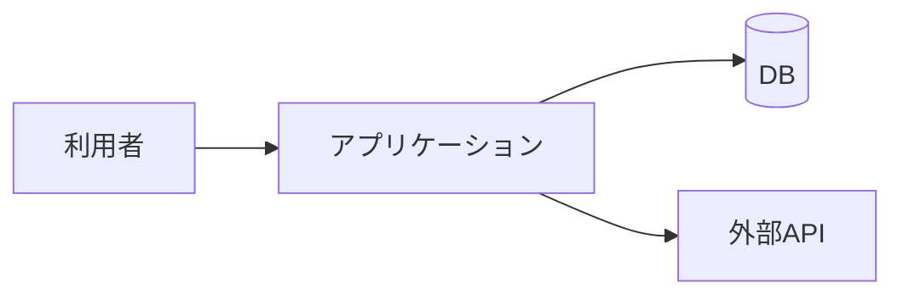

# システム構成図・データ所有者表 — <プロジェクト名>

> 記入要領: この文書の完了条件は「図が描けた」ではなく「**データ所有者表の全行に実物確認の日付が入った**」。
> 実物確認 = 実 API のレスポンスを見た / 実データを 1 件目で見た / レート制限・認証を実際に通した。
> 確認できない行は課題管理表に「観測待ち」で起票し、その行に依存する設計を先へ進めない。

## 構成図

## データ所有者表

| データ | 所有者(誰のもの/どこにある) | 取得方法 | 更新頻度・鮮度 | 実物確認(日付・方法) |
|---|---|---|---|---|
| 例: 広告CV | 広告プラットフォーム | Ads API | 日次 | 2026-07-10 API実叩き・21件確認 |
|  |  |  |  | **未確認 → Q-xx** |

## 環境・公開範囲

| 項目 | 内容 |
|---|---|
| 実行環境(どこで動く) |  |
| 公開範囲(誰がアクセスできる) |  |
| 秘匿情報(API キー等)の置き場 |  |

## 前提条件・仮定事項(AI の申告転記欄)
