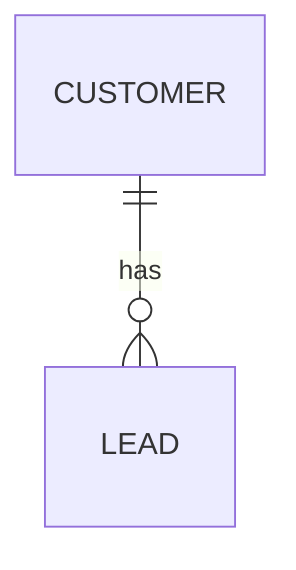

# テーブル定義書(ER図) — <プロジェクト名>

> 記入要領: エンティティ・カラム名は用語集から取る(用語集に無い語が生えたら AI の補完 → 申告欄へ)。
> 各カラムに 3 注記を必ず書く:
> ① **保存か導出か** — 導出できる値を保存するなら理由必須(保存した値は元データと乖離して嘘をつける)
> ② **NULL の意味** — 「無い」が業務上いつ起こるか。書けないなら NULL 許容にしない
> ③ **0 と未観測の区別** — 数値カラムは「0 だった」と「まだ見ていない」をどう区別するか

## ER図

## テーブル定義

### <テーブル名> — <1文の説明(用語集の語で)>

| カラム | 型 | NULL | 保存/導出 | 注記(NULLの意味・0の区別・導出保存の理由) | 出典 |
|---|---|---|---|---|---|
| id |  | 不可 | 保存 | — |  |
|  |  |  |  |  |  |

## 前提条件・仮定事項(AI の申告転記欄)
<!-- テーブル設計は AI の補完が最も混入しやすい成果物。3手目の締めを省略しない -->
