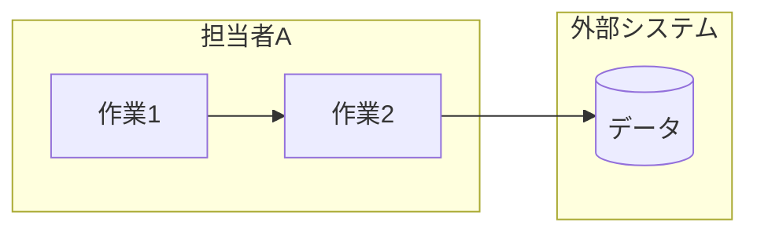
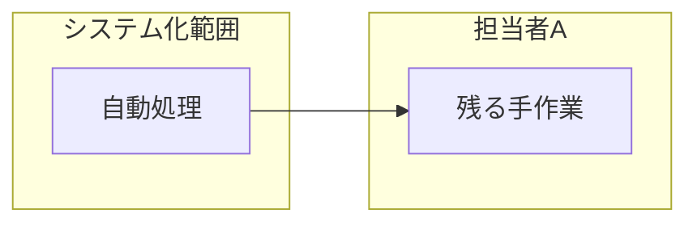

# 業務フロー図 — <業務名>

> 記入要領: 登場人物(人・外部システム)ごとにレーンを切る。To-Be ではシステム化範囲を
> subgraph で囲む。As-Is は一次情報または業務担当者に確認してから確定(確認日を書く)。

## As-Is(現状) — 確認日: YYYY-MM-DD(誰に/何で)

### 例外ケース(正常フローから外れる場合)
<!-- 要約で最初に消えるのがここ。一次情報の原文から拾う -->

- 

## To-Be(システム導入後)

## As-Is → To-Be で消える作業・残る作業・新しく増える作業

| 作業 | As-Is の担当 | To-Be の担当 | 備考 |
|---|---|---|---|
|  |  |  |  |

## 前提条件・仮定事項(AI の申告転記欄)
